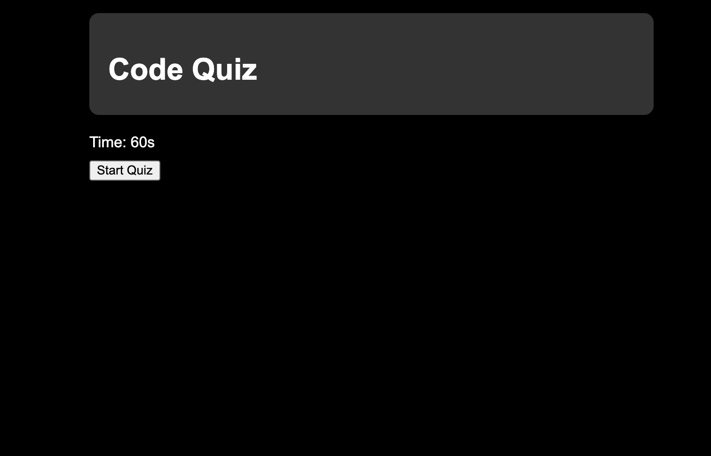
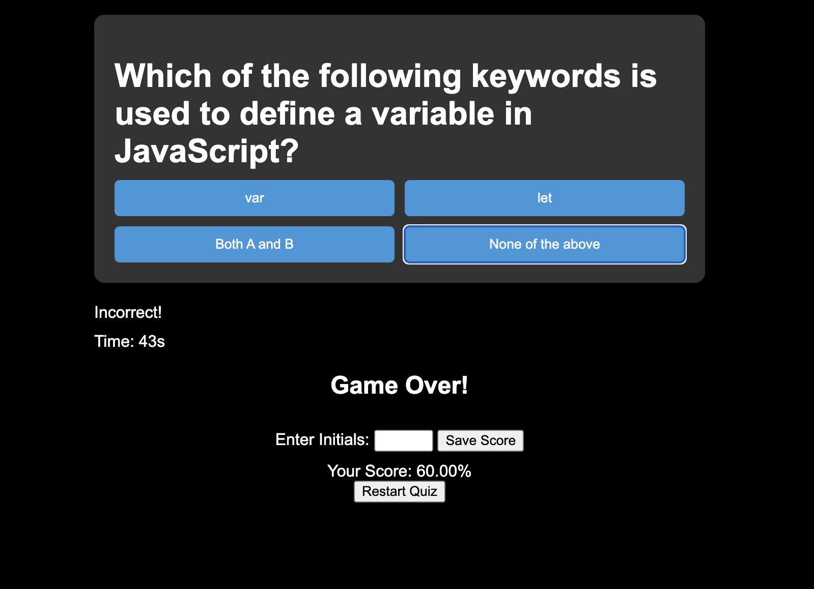

# 04 Code Quiz

this Challenge invites you to build a timed coding quiz with multiple-choice questions. This app will run in the browser and will feature dynamically updated HTML and CSS powered by JavaScript code that you write. It will have a clean, polished, and responsive user interface. 

## Screenshots
Beginning of Quiz..

End of Quiz..

### Links
https://github.com/dougyfresh208/04-code-quiz

https://dougyfresh208.github.io/04-code-quiz/
